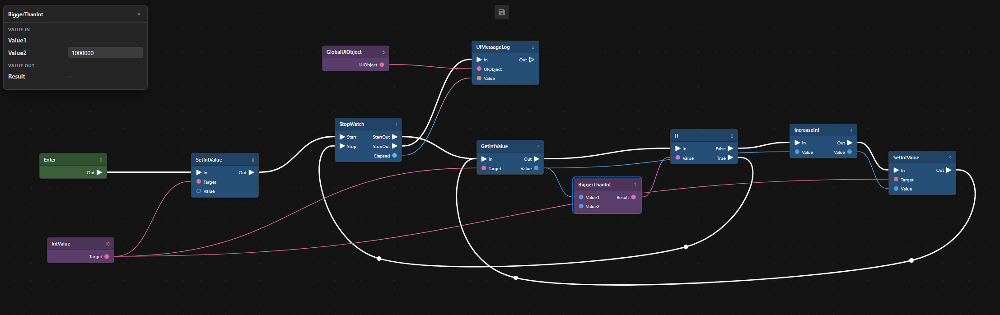

# MScript

MScript is a graph-node visual scripting system for C#. with MScript, you can define nodes by just adding attributes to your C# classes and methods, and then edit/debug graphs through web browsers.

MScript aims for good performance. MScript uses no reflection and uses a Roslyn source generator to generate the necessary code at compile time. GC is also minimized, as most allocation and instance creation happen at graph-instance creation time.

the graph script below, run for 1,000,000 cycles, costs about 0.15 seconds (20ns per node) in a CoreCLR environment and about 0.5 seconds (60ns per node) in a Unity 6.5 IL2CPP environment on an AMD Ryzen 5 7500F CPU. the only GC-related operation in the example graph script is the cast from double to string between the nodes `StopWatch` and `UIMessageLog`, which is introduced entirely by the business logic itself.



the workflow of MScript is designed around a **browser editor**-**intermediate server**-**client runtime** structure, and supports editing and debugging in a real runtime environment and in remote environments.

<!-- <video src="doc/runtime-example.mp4" controls></video> -->
https://github.com/user-attachments/assets/cde3fbb6-dedd-4612-81eb-1eb72c6c3315

## Getting Started

+ set up the server. the server also contains the web editor.
    
    ```
    docker run -d -p 50051:50051 -p 9002:9002 --init sunmoonmori/mscriptdevserver:1.0.0
    ```
    
    (you can also use the windows version provided in the release, though it's not the recommended way)

    then you can access the web editor through a browser, for example at http://localhost:9002

+ set up the client by installing the DLLs. there are three parts:
    
    + **MScript.dll**: the core runtime.

    + **MScriptGenerator.dll**: the Roslyn source generator that generates the necessary code.

    + **MScriptDevCli.dll**: the client logic that provides visual scripting and debugging. you can include this in your build for runtime editing and debugging, but it is not a necessary part at all.

+ read the [sample](Assets/SampleScene/SampleCode) in this repository. it shows examples of server connection, serialization and graph-script management for both edit-time and runtime.

## Concepts

### Node

you can define nodes by creating classes and adding certain attributes to them and to their methods. see the [sample](Assets/SampleScene/SampleCode/Node).

+ defining nodes with class attributes

    by adding the `ProcedureNode`, `EntranceNode` or `FunctionNode` attribute, a class will be treated as a node definition by the Roslyn source generator, and the necessary code will be generated. the class's member methods with the `FlowIn` attribute will be treated and called as flow-ins of the node. the member methods with the `Initialize` and `Destroy` attributes will be treated as node life-cycle callbacks and triggered when a graph instance is initialized and destroyed.

+ **static** and non-**static** classes

    for nodes generated by non-static classes, one node instance per node in a graph will be created when a graph instance is created. and for nodes generated by static classes, no instance will be created. it's a good practice to define static classes instead of non-static ones.

+ `ProcedureNode`, `EntranceNode` and `FunctionNode`

    procedure node, entrance node and function node are three types of nodes.

    + procedure node: a procedure node can have multiple flow-ins, flow-outs, async-flow-outs, value-ins and value-outs. all these ports will be visible and connectable in the editor. the flow-ins will be explicitly triggered by control-flow connections in the graph.

    + entrance node: an entrance node is the same as a procedure node, except its flow-ins will be invisible in the editor. these flow-ins will be queried and called from C# code and act as the entrance of the graph logic.

    + function node: a function node can only have one flow-in and no flow-out or async-flow-out, and the return type of its flow-in method must be `int`. the flow-in of a function node will be automatically triggered every time its value-out is accessed.

+ `FlowIn`

    the flow-ins, flow-outs, async-flow-outs, value-ins and value-outs are defined by the `FlowIn` attribute. a member method with this attribute must have exactly one argument of type `MScriptWrapper.<XXXNodeAttribute.Name>.<FlowInAttribute.Name>Context`, and the return type must be `int` or `IEnumerable<int>`.

    when defining `ValueIn` and `ValueOut`, you must also define `ValueInType` and `ValueOutType` correspondingly. you can then access the value-ins and value-outs through the method argument: `ctx.GetXXX()` and `ctx.SetXXX()`.

    to pass control flow to a flow-out, you should `return` or `yield return` the flow-out from the method argument: `ctx.GotoXXX()` or `ctx.Discard()`. because you can define a method with return type `IEnumerable<int>`, you can trigger multiple flow-outs multiple times when a flow-in is triggered only once.

    flow-out and async-flow-out are separated explicitly. it's the node methods' responsibility to make sure the async-flow-out is called from another call stack on the main thread, for example by a `Coroutine` or `SynchronizationContext`. by doing so, stack overflow will be prevented in theory. you can call the async-flow-out with `ctx.CallXXX()`.

    the flow-ins, flow-outs, async-flow-outs, value-ins and value-outs in the same node class share the same port-namespace per type. for example, if two methods with the `FlowIn` attribute both define a flow-out named "Out", their `ctx.GotoOut()` calls will lead to the same flow-out port.

+ `Initialize` and `Destroy`

    a member method with the `Initialize` or `Destroy` attribute must have exactly one argument of type `MScriptWrapper.<XXXNodeAttribute.Name>.Context`, and the return type must be `void`. through the argument, the method can access all value ports.

### MScriptImage

the target of editing, saving and serializing is the graph image called MScriptImage. see the [sample](Assets/SampleScene/SampleCode/Script). you can (and should) customize your own serialization and out-of-dev-cli image management.

you can use `GetEntranceQuerier()` to get certain entrance node callers of an image. you can call these entrances with the queried results and a graph instance. 

### MScript

the carrier of the running runtime logic and the target of debugging is the graph instance called MScript. see the [sample](Assets/SampleScene/SampleCode/Script). you can (and should) customize your own out-of-dev-cli instance management.

you can pass an object as the global variable root when initializing an instance. every node will be able to access this global variable root through its context.
